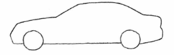
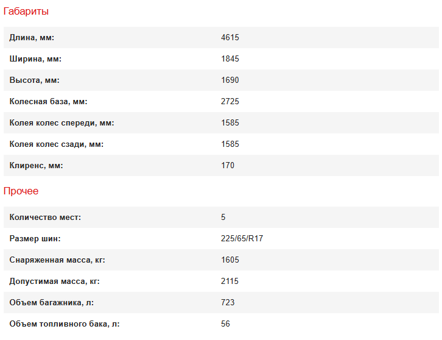
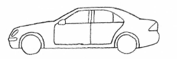

# oop
изучаю ООП


## Основы основ...

что такое Абстракция?

абстракцией мы можем назвать любую вещь из реального мира, которая имеется в нашем понимании


например:

представим что нам нужно работать на предприятии 

в этом предприятии мы собираем разную технику (грубо говоря от батона до гандона)

и вот вы пришли на такое предприятие и вам говорят что нуужны машины

мы рисуем в голове представление машины (не заморачиваясь в детали [болты, колеса, стекла]), обычная машина что есть в голове
пусть будет она примерно такой:



и вот у нас есть что то похожее на машину (нно мысленно в нашей голове)

теперрь нам нужно как то это отразить в письменном виде (в коде)

тогда мы создаем абстракцию Car

```python
class Car:
    pass
```


это как раз схоже с теми действиями, что мы сделали мысленно

мы представили какую то машину (тоочнее ее представление или облик) в голове, и теперь это отобразили в коде.

### **вот как раз Абстракцией и называют то, что есть в реальном мире но без детального описания всего**

раз мы разобрались с абстракцией, то продолжим помогать нашему предприятию...

--------------------------------------------------------

предприятие на которое мы работаем решает произмодить машины.

вот мы создали какую то машину
```python
class Car:
    pass
```
да, да. мы художники и мы так видим....
нам сказали МАШИНА, мы это отобразилли в коде, нам ведь недавали какие то уточнения, что за машины, на чем ездят, как есздят, что за двигатели и тп...


и вот к нам приходят инжинеры из разных отделов, и по очереди нам накидывают детали представления машины

что там будет в этой машине, сколько дверей, размеры дверей и тд...

и вот мы собираем все эти данные, которые вроде как понятны нам, но не понятно как это написать в коде, чтоб каждый отдел мог создавать свою деталь и не мешать остальным, а потом просто это все собирается в одну МАШИНУ




вот уже наша абстракция преобразовывается в что то подобное.. (но пока что у нас в голове но не в коде)




у нас есть количество дверей, габариты, колеса и тп..

```python
class Car:
    
    def __init__(self, door, height, width, length, engine_type):
        self.doors = door # количество дверей
        self.height = height # высота машины
        self.width = width # ширина
        self.length = length # длина
        self.engine_type = engine_type # тип двигателя

    def move(self):
        pass

    def signal(self):
        pass
    

if __name__ == '__main__':
    car1 = Car(door=3, height=100, width=200, length=100, engine_type="Benzine")

    print(car1.engine_type)
```

вот уже мы что то отобразили и в коде, то что было у нас собрано от завок индинеров

хорошо..  сможем ли мы теперь создавать машины? сомнительно.... но подобие авто у нас может появиться
и даже получить какие то данные о машине мы тоже можем

### кстати: car1 - это ИНСТАНС  (экземплар класса Car)  копия класса машины (Car)

------------------------------------------------------

раз мы разобрались с понятием АБСТРАКЦИЯ и ИНСТАНС. мы можем уже этим манипулировать (работать) и понимать литературу в которой будут встречаться данные термины..

далее поговорим про наследование

------------------------------------------------------
Наследование - это когда один класс наследует свойства другого


вот у нас есть класс (абстракция) МАШИНА, но какая конкретно это машина, мы не знаемм, но на основе этого класса мы сможем сделать множество разных машин

пришли инжинеры и говорят:
мы делаем обычный автомобиль для ежедневных поездок, он должен быть не большим, мотор должен не много потреблять топлива, и назовем его ВАЗ 2106

мы поняли задачу и предсталяем в своей голове авто типа сидан с 5ю дверями, и мотором на 1.2 литра

хорошо... но что нам делать? дописывать наш класс МАШИНА или же оставить его таким, какой он есть сейчас и создать новый класс, в котором будет добавлено то, что попросили сейчас инжинеры?
вывод: создать новый класс и назвать его Vaz 

почему? мы ведь можем легко дописать сейчас нужные нам поля и методы и вот у нас машина 2106 и дело в шляпе...

мысль вроде как верная, НО... не много заглянем в будущее и предположим что нам нужно будет создавать не только такие машины, но и спортивные или иного типа кузова, тогда мы все равно придем к тому, что нам нужно создавать под каждый тип кузова, тип двигателя и марки отдельные классы, а на тото момоент наша кодовая база может переполнится много чем, что добавили инжинеры и найти и вычленить то, что нам так необходимо для каждого авто и убрать для нового авто будет оооооочень сложно, потому и нам в помощь приходит наследование...
с помощью наследования мы можем создавать новые машины и не править постоянно что то, что и так у всех есть


у программистов принято называть основного родителя - базовый класс, и мы поступим так же

```python
class BaseCar:
    
    def __init__(self, door, height, width, length, engine_type):
        self.doors = door  # количество дверей
        self.height = height  # высота машины
        self.width = width  # ширина
        self.length = length  # длина
        self.engine_type = engine_type  # тип двигателя

    def move(self):
        pass

    def signal(self):
        pass


class Vaz(BaseCar):
    
    def __init__(self, door, height, width, length, engine_type, model):
        super().__init__(door, height, width, length, engine_type)
        self.model = model  # модель ВАЗ

    def move(self):
        print(f"ВАЗ {self.model} поехал.")

    def signal(self):
        print(f"ВАЗ {self.model} сигналит: Би-би!")


# Пример использования
car1 = Vaz(4, 1450, 1700, 4200, "бензиновый", "2107")

car1.move()
car1.signal()

```
